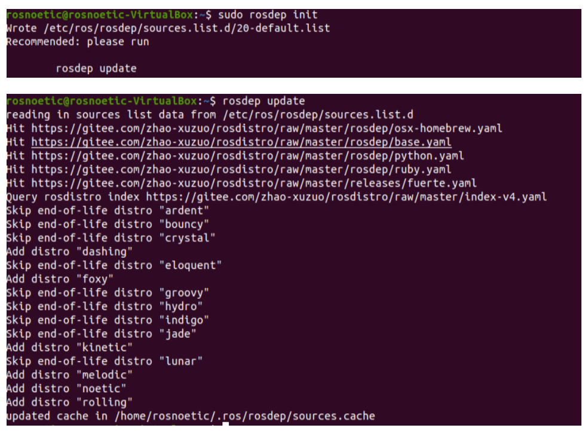

# ROS安装

**Author：**Iccccy     **Data：**2021-10-19

> 参考文档：[melodic/Installation/Ubuntu - ROS Wiki](http://wiki.ros.org/melodic/Installation/Ubuntu)
>
> 说明：本文档实用的ROS版本为melodic

## 设置ros软件源

+ 设置ros源

  ```shell
  sudo sh -c '. /etc/lsb-release && echo "deb http://mirrors.tuna.tsinghua.edu.cn/ros/ubuntu/ `lsb_release -cs` main" > /etc/apt/sources.list.d/ros-latest.list'
  ```

  + 设置安装key

  ```shell
  sudo apt-key adv --keyserver 'hkp://keyserver.ubuntu.com:80' --recv-key C1CF6E31E6BADE8868B172B4F42ED6FBAB17C654
  ```

+ 更新apt列表

  ```shell
  sudo apt update
  ```

## 安装

推荐安装Desktop-Full版本，包含了主要的功能包。

**终端命令：**

```shell
sudo apt install ros-melodic-desktop-full
```

其他功能包的安装，请查看源文档或后期文档。

## 环境设置

将ros软件设置添加为环境工具：

**bash终端**

```shell
echo "source /opt/ros/melodic/setup.bash" >> ~/.bashrc
source ~/.bashrc
```

**zsh终端**

```shell
echo "source /opt/ros/melodic/setup.zsh" >> ~/.zshrc
source ~/.zshrc
```

## 添加编译依赖包并编译ROS

安装如下编译依赖（dependencies）和工具包（tools）：

```shell
sudo apt install python-rosdep python-rosinstall python-rosinstall-generator python-wstool build-essential
```

安装rosdep（依赖工具）

```shell
sudo apt install python-rosdep
```

初始化rosdep

```shell
sudo rosdep init
rosdep update
```

## 安装成功



**Congratulations！**:smile:

## **问题解决**

### 1.运行**rosdep init**失败

**解决方法：**

​	1.使用移动热点进行rosdep的初始化，注意流量损耗；

​	2.使用科学上网技术进行初始化；

​	3.参考以下教程，进行手动安装：

+ **目的：将所有涉及国外软件下载的源，更换为国内下载源；**

+ 修改list文件

  ```
  sudo gedit /etc/ros/rosdep/sources.list.d/20-default.list
  ```

  将全部内容更换为如下：

  ```shell
  # os-specific listings first
  yaml https://gitee.com/zhao-xuzuo/rosdistro/raw/master/rosdep/osx-homebrew.yaml osx
  
  # generic
  yaml https://gitee.com/zhao-xuzuo/rosdistro/raw/master/rosdep/base.yaml
  yaml https://gitee.com/zhao-xuzuo/rosdistro/raw/master/rosdep/python.yaml
  yaml https://gitee.com/zhao-xuzuo/rosdistro/raw/master/rosdep/ruby.yaml
  gbpdistro https://gitee.com/zhao-xuzuo/rosdistro/raw/master/releases/fuerte.yaml fuerte
  
  # newer distributions (Groovy, Hydro, ...) must not be listed anymore, they are being fetched from the rosdistro index.yaml instead
  
  ```

  

+ 修改安装文件

  ```shell
  cd /usr/lib/python3/dist-packages/
  #依次修改以下四个文件
  sudo gedit ./rosdistro/__init__.py
  sudo gedit ./rosdep2/gbpdistro_support.py
  sudo gedit ./rosdep2/sources_list.py 
  sudo gedit ./rosdep2/rep3.py
  ```

  将其中所有涉及以下**URL**

  ```shell
  raw.githubusercontent.com/ros/rosdistro
  ```

  更换为

  ```shel
  gitee.com/zhao-xuzuo/rosdistro/raw
  ```

+ 再次安装
