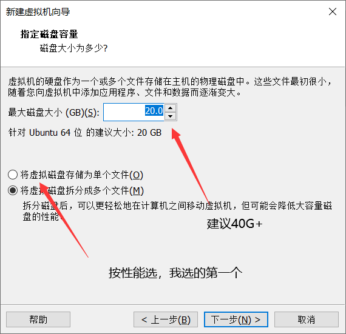
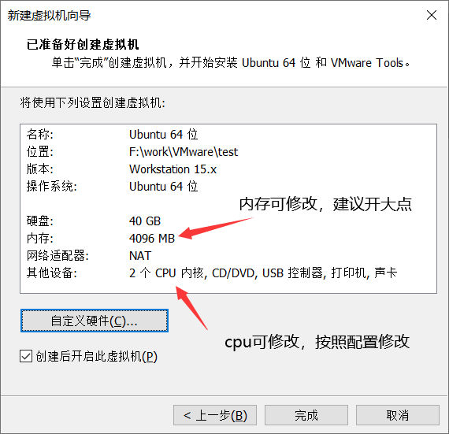

# 虚拟机安装

**Author**：Iccccy     **Data**：2021-10-19

> 建议对性能有要求的同学，安装实体系统进行开发和测试，避免造成性能或内存不足、虚拟机对一些驱动不兼容等情况出现。
>
> 建议仅进行测试的同学安装使用虚拟机。

## 准备材料

### 镜像下载

推荐国内开源镜像站：

+ [阿里巴巴开源镜像站-OPSX镜像站-阿里云开发者社区 (aliyun.com)](https://developer.aliyun.com/mirror/)

注意事项：

+ 推荐选择OS镜像Ubuntu18.04LTS下载与安装；
+ 本文档的绝大部分实验是基于Ubuntu18.04LTS环境下实现；
+ 新手建议：下载时注意选择desktop版本，即为桌面完整版本；

### 虚拟机软件

推荐使用VMware作为虚拟机运行软件。

下载地址：https://www.ghxi.com/vmware15.html

## 安装过程

### 快速创建系统安装

+ 选择**系统镜像Ubuntu18.04**

+ 输入**用户账号**和**主机信息**

+ 选择**安装位置**（有充足的本地磁盘容量）

+ 选择**磁盘容量**

  

+ 选择**具体配置**：

  

### 自定义安装

[【最新】教你六分钟学会搭建虚拟机！二、Linux篇，请看简介，妈妈再也不用担心我的系统问题啦！_哔哩哔哩_bilibili](https://www.bilibili.com/video/BV1oE411A7as?from=search&seid=10792511793982291095&spm_id_from=333.337.0.0)

## Ubuntu初始配置

### 软件源更换

#### 图形方式

+ 在**设置-软件与更新**中，选择中国国内镜像；

+ 在 **终端** 中运行

  ```shell
  sudo apt update
  ```

#### 编辑方式

+ 设置软件源

  + 清华源官网：[ubuntu | 镜像站使用帮助 | 清华大学开源软件镜像站 | Tsinghua Open Source Mirror](https://mirror.tuna.tsinghua.edu.cn/help/ubuntu/)

+ 编辑软件源列表

  **运行如下命令：**

  ```shell
  sudo gedit /etc/apt/sources.list	
  ```

  **在打开的编辑器中，文档末尾添加以下内容：**

  ```shell
  # 默认注释了源码镜像以提高 apt update 速度，如有需要可自行取消注释
  deb https://mirrors.tuna.tsinghua.edu.cn/ubuntu/ focal main restricted universe multiverse
  # deb-src https://mirrors.tuna.tsinghua.edu.cn/ubuntu/ focal main restricted universe multiverse
  deb https://mirrors.tuna.tsinghua.edu.cn/ubuntu/ focal-updates main restricted universe multiverse
  # deb-src https://mirrors.tuna.tsinghua.edu.cn/ubuntu/ focal-updates main restricted universe multiverse
  deb https://mirrors.tuna.tsinghua.edu.cn/ubuntu/ focal-backports main restricted universe multiverse
  # deb-src https://mirrors.tuna.tsinghua.edu.cn/ubuntu/ focal-backports main restricted universe multiverse
  deb https://mirrors.tuna.tsinghua.edu.cn/ubuntu/ focal-security main restricted universe multiverse
  # deb-src https://mirrors.tuna.tsinghua.edu.cn/ubuntu/ focal-security main restricted universe multiverse
  
  # 预发布软件源，不建议启用
  # deb https://mirrors.tuna.tsinghua.edu.cn/ubuntu/ focal-proposed main restricted universe multiverse
  # deb-src https://mirrors.tuna.tsinghua.edu.cn/ubuntu/ focal-proposed main restricted universe multiverse
  ```

  **在终端中运行：**

  ```shell
  sudo apt update
  ```


### 推荐软件下载

#### Terminator

多窗口终端编辑器；

```shell
sudo apt-get install terminator
```

#### VScode

实用的文档编辑器；

> [Visual Studio Code - Code Editing. Redefined](https://code.visualstudio.com/)

#### Zshell&~Oh my zsh

强大的shell工具；

> [ZSH - THE Z SHELL (sourceforge.io)](https://zsh.sourceforge.io/)
>
> [Oh My Zsh - a delightful & open source framework for Zsh](https://ohmyz.sh/)

