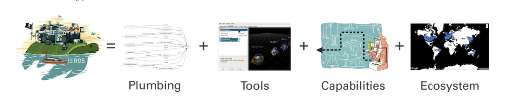

# ROS安装简介

**Author：**Iccccy     **Data：**2021-10-19

> 资料参考于互联网

## ROS简介

**ROS全称Robot Operating System(机器人操作系统)**

- ROS是适用于机器人的**开源**元操作系统；

- ROS集成了**大量的工具，库，协议**，提供类似OS所提供的功能，简化对机器人的控制；

- 还提供了用于在**多台计算机**上获取，构建，编写和运行代码的工具和库，ROS在某些方面类似于“机器人框架”；

- ROS设计者将ROS表述为“ROS = Plumbing + Tools + Capabilities + Ecosystem”，即ROS是通讯机制、工具软件包、机器人高层技能以及机器人生态系统的集合体。

  

  

## 安装简介

主要步骤如下：

+ 安装并配置Ubuntu虚拟机或者实体系统；
+ 安装并初始化ROS系统；
+ 测试系统功能；

完成以上三个步骤，你就成功安装了ROS系统啦！:happy:

